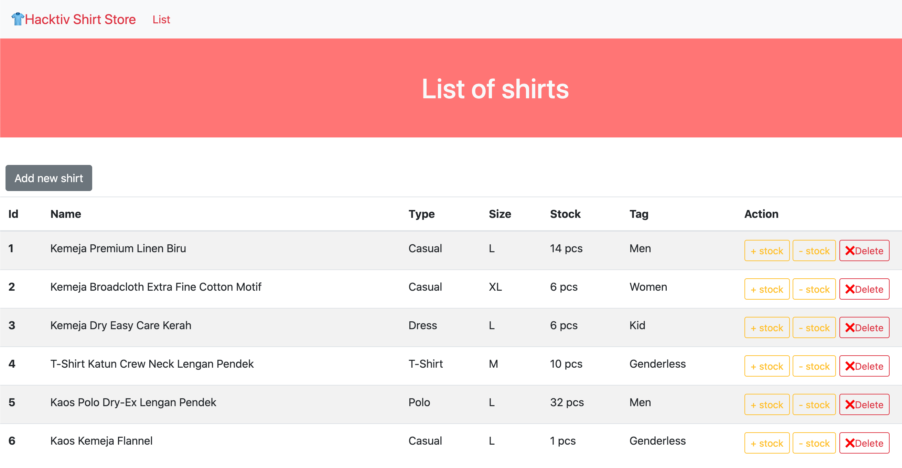
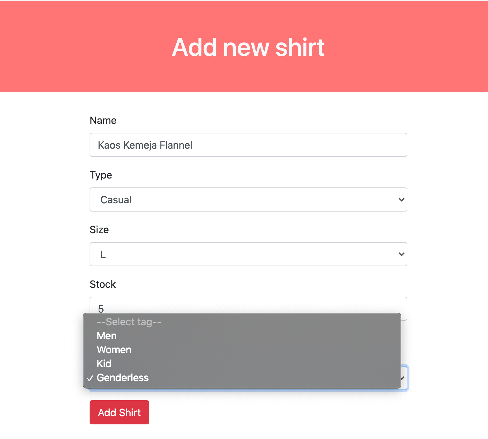
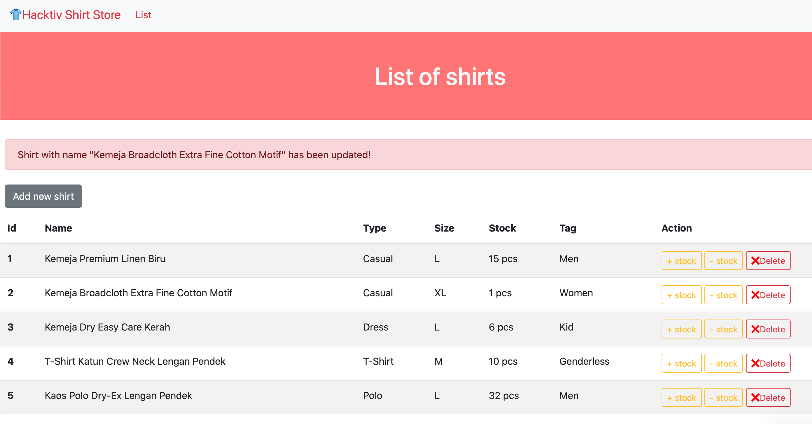
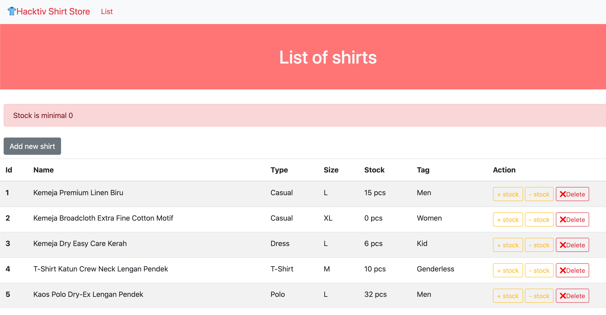
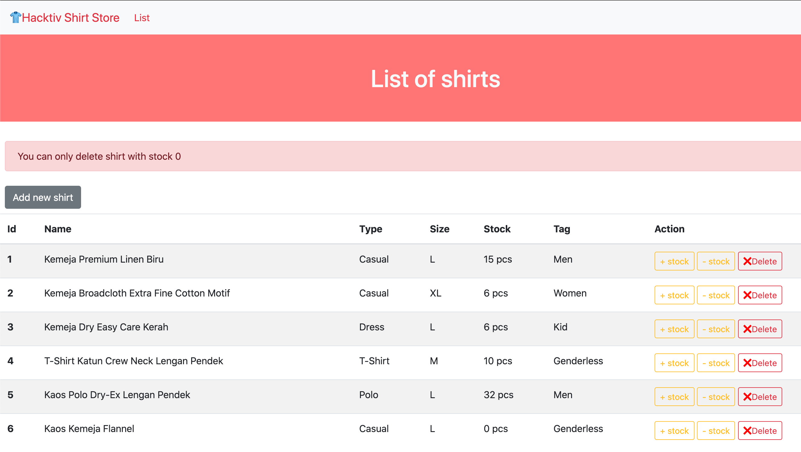
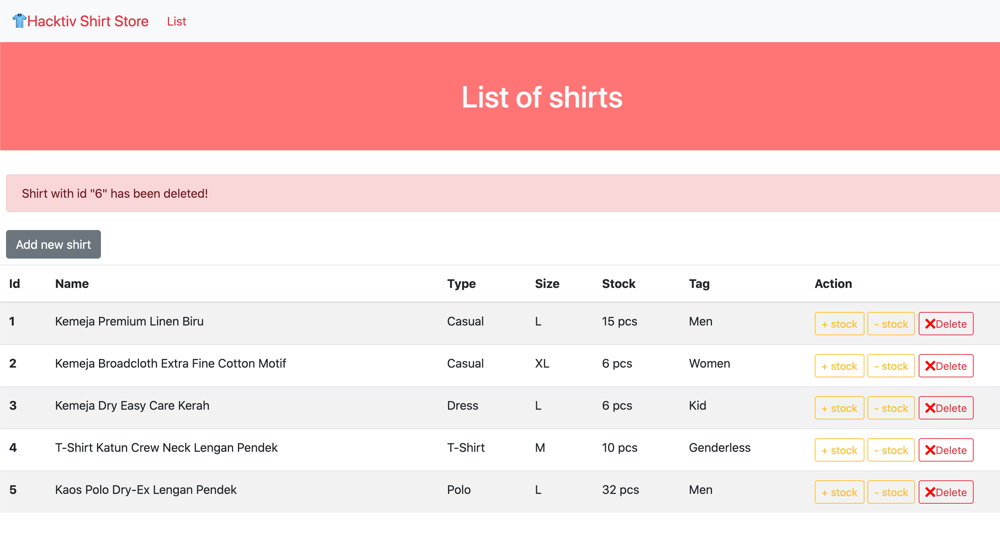
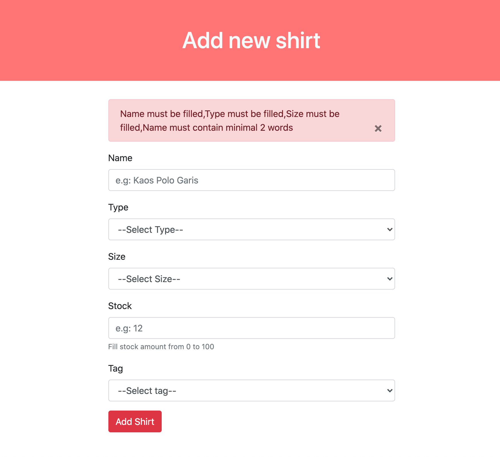

# 👕 Hacktiv Shirt Store

⏰ Time Estimation 180 minutes 

### Livecode Phase 1 Week 3

Sebuah toko baju meminta bantuan kamu untuk membuat aplikasi yang melakukan listing terhadap baju yang mereka jual. Data yang akan disimpan adalah nama baju, harga, dan jumlah yang tersedia (stok), tipe, ukuran dan tag baju. Tag baju sendiri di toko ini hanya menjual untuk Pria, Wanita, Anak-anak, dan Genderless.

## Release 0 (5 Point)
Buatlah sebuah database schema diagram dalam bentuk digital yang menunjukkan struktur database yang akan digunakan untuk membuat aplikasi ini. Lebih detail lihat `Release 1`.
Simpan file screenshoot ERD dengan nama file `erd.png`.

>note : 1 Tag bisa mempunyai lebih dari 1 Baju dan 1 Baju hanya memiliki 1 Tag.

## Release 1 (9 Point)
Buatlah *DATABASE* bernama `shirt-db` pada database PostgreSQL.
> Nama database wajib sesuai dengan requirement

Buatlah file `setup.js` yang berfungsi untuk membuat table `Tags` dan `Shirts` yang memiliki kolom-kolom sebagai berikut:

### Table Tags
| Field         | Datatype | Modifiers   |
| ------------- | -------- | ----------- |
| id            | SERIAL   | PRIMARY KEY |
| name          | VARCHAR  | NOT NULL    |

### Table Shirts
| Field         | Datatype | Modifiers   |
| ------------- | -------- | ----------- |
| id            | SERIAL   | PRIMARY KEY |
| name          | VARCHAR  | NOT NULL    |
| type          | VARCHAR  | NOT NULL    |
| size          | VARCHAR  | NOT NULL    |
| stock         | INTEGER  | NOT NULL    |
| TagId         | INTEGER  | FOREIGN KEY |

Jalankan file `setup.js` untuk membuat table `Tags` dan `Shirts` pada database yang telah dibuat.

## Release 2 (7 Point)
Buatlah `sebuah` file `seed.js` yang berfungsi untuk melakukan seeding data ke dalam table `Tags` dan `Shirts` berdasarkan data dari `tags.json` dan `shirts.json`.

Jalankan file `seed.js` untuk melakukan seeding ke table pada database.

## Release 3 (8 Point)

Buatlah routing dengan menggunakan `ExpressJS` agar dapat melakukan *CRUD operations* dengan detail sebagai berikut:

| Method | Route              | Keterangan                                                                                                                      |
| ------ | -----------------  | ------------------------------------------------------------------------------------------------------------------------------- |
| GET    | /                  | Menampilkan semua baju yang ada di dalam table `Shirts`                                                                         |
| GET    | /shirts/add        | Menampilkan halaman form untuk menambahkan data baju                                                                            |
| POST   | /shirts/add        | Menerima data yang dikirim dari halaman `/shirts/add` untuk melakukan _insertion_ ke dalam table `Shirts`                       |
| GET    | /shirts/increase-stock/:id   | Melakukan edit data stock baju (+1) berdasarkan `id` yang dikirimkan                                              |
| GET   | /shirts/decrease-stock/:id   | Melakukan edit data stock baju (-1) berdasarkan `id` yang dikirimkan     |
| GET    | /shirts/delete/:id | Melakukan _delete_ data baju berdasarkan `id` yang dikirimkan                                                                   |

## Release 4 (48 Point)
### Halaman Home atau Route `/`
Implementasikan routing `/` dengan membuat halaman `Home` dimana halaman ini menampilkan semua baju yang ada pada table `Shirts` dalam bentuk list yang terdiri dari kolom **id**, **name**, **type**, **size**, **stock**, **tag** (tag name), dan **action**.

Pada kolom action terdapat 3 button link yaitu:
- `+ stock` akan mengarah ke  `/shirts/increase-stock/:id`
- `- stock` akan mengarah ke  `/shirts/decrease-stock/:id`
- `x delete` akan mengarah ke `/shirts/delete/:id`.

### Halaman Add Shirt atau Route `/shirts/add`
Halaman add akan menampilkan form untuk memasukkan data baju yang akan disimpan ke dalam database.

Untuk bagian `type` menggunakan select input yang terdapat 4 pilihan:
  - Casual
  - Dress
  - T-Shirt
  - Polo

Untuk bagian `size` menggunakan select input yang terdapat 4 pilihan:
  - S
  - M
  - L
  - XL

Untuk bagian `tag` menggunakan select input dimana pilihannya dinamis dari database table `Tags`

Apabila berhasil menambahkan baju maka halaman akan berpindah ke home atau `/`

## Release 5 (19 Point)

### Button + Stock atau Route `GET /shirts/increase-stock/:id`
Button ini berfungsi untuk menambahkan stock baju (+1) dengan `id` yang dikirimkan.
Apabila berhasil update stock baju maka halaman akan berpindah ke home atau `/`

### Button - Stock atau Route `GET /shirts/decrease-stock/:id`
Button ini berfungsi untuk mengurangi stock baju (-1) dengan `id` yang dikirimkan. Dengan ketentuan minimum stock baju adalah **0**. Apabila sudah **0** maka tidak bisa diminus lagi stocknya.
Apabila berhasil update stock baju maka halaman akan berpindah ke home atau `/`

### Delete Shirt atau Route `/shirts/delete/:id`
Untuk mengimplementasikan routing ini, kamu tidak perlu membuat halaman baru, tapi cukup dengan menekan tombol delete yang akan mengarahkan routing ke `/shirts/delete/:id` dimana proses delete akan dilakukan berdasarkan `id` yang dikirimkan.
> Hanya baju yang memiliki `stock` **0** yang dapat dihapus

Apabila berhasil menghapus baju maka halaman akan berpindah ke home atau `/`

## Release 6 (4 Point)
Buatlah validasi pada **server** untuk fitur `Add`:

### Add:
- `name` harus terdiri dari minimal 2 kata (*words*)
- `type` tidak boleh dikosongkan
- `size` tidak boleh dikosongkan
- `stock` harus terdiri dari number diantara 0 - 100
- `tag` tidak boleh dikosongkan

Jika kondisi diatas tidak terpenuhi maka data tidak akan bertambah/berubah dan tampilkan pesan error.

**NOTE**
Untuk pesan error bisa ditampilkan dengan menggunakan `res.send`. Pesan error bebas selama yang ditampilkan jelas dan sesuai dengan error yang terjadi.
